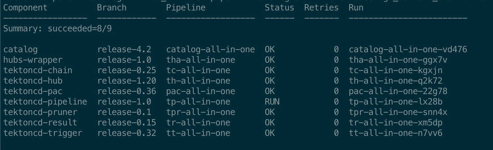
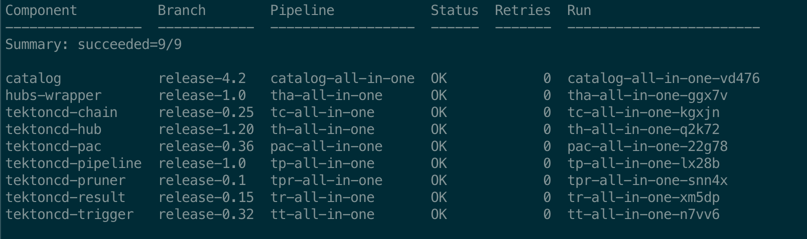
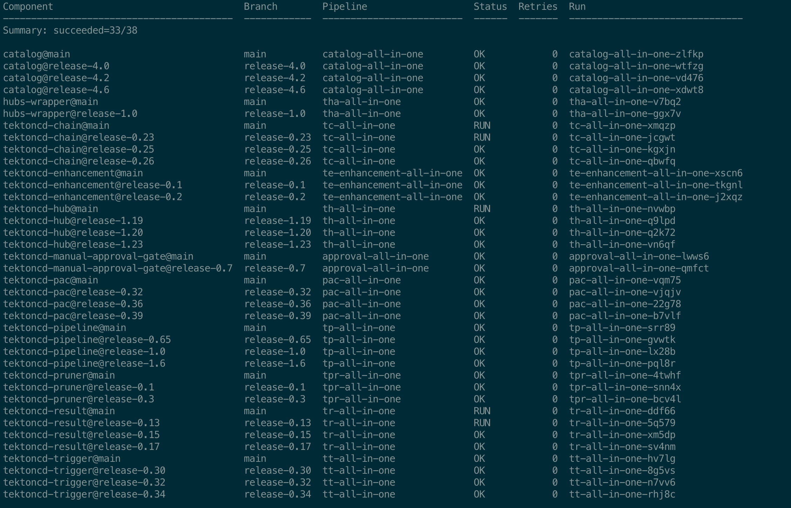
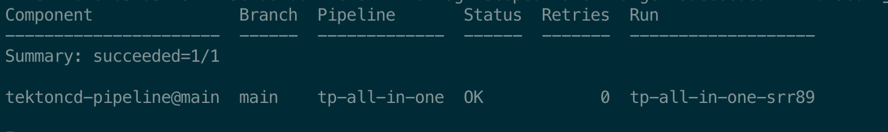
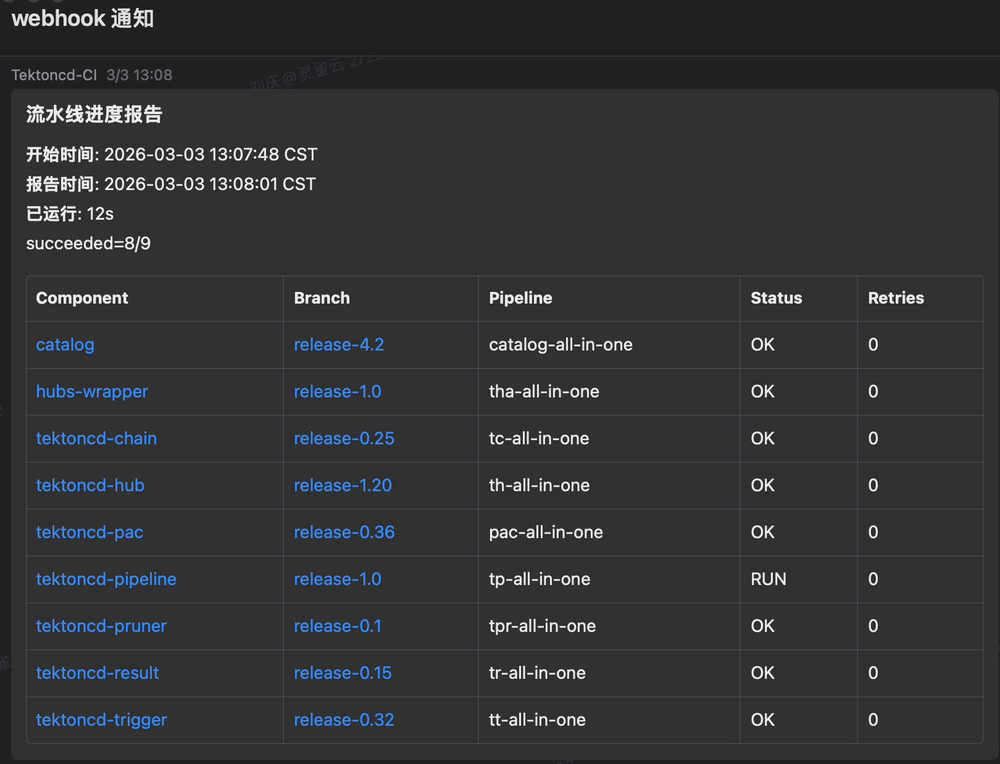
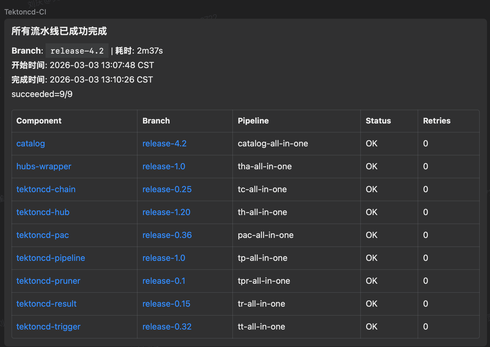
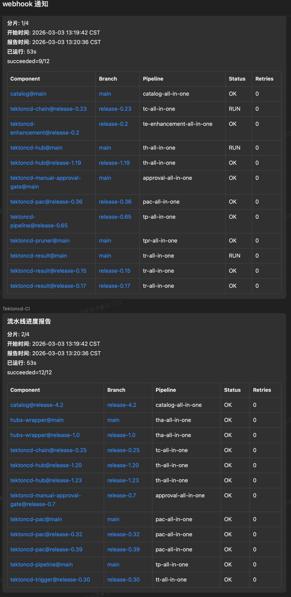
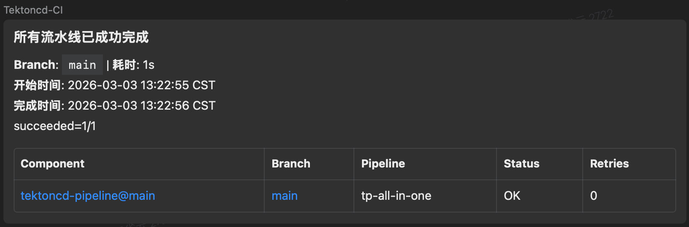

# Porch — AI 驱动的多组件流水线编排器

> **Pipeline Orchestrator**: 从 11 组件 × 人工轮询的发版噩梦，到一键全自动监控、重试、通知的 AI 协作实战

---

## 1. 项目概览

| 维度 | 详情 |
|------|------|
| **项目名称** | Porch (**P**ipeline **ORCH**estrator) |
| **作者** | 刘庆 (DevOps 团队) |
| **技术栈** | Go + Cobra/Viper + Logrus + gh CLI + kubectl |
| **代码规模** | 3,400+ 行业务代码 + 1,600+ 行测试代码，36 个 Go 源文件 |
| **AI 工具** | Claude Code (claude-opus-4.6) + Codex (codex-5.3) — 全程多 AI 协作开发 |
| **开发周期** | 22 个 commits，从设计文档到生产可用 |
| **GitHub 仓库** | [github.com/l-qing/porch](https://github.com/l-qing/porch) |

---

## 2. 痛点与动机

### 发版日的噩梦

`tektoncd-operator` 管理 **11 个子组件**（pipeline、pac、chains、triggers、results 等），每次发版修漏洞的流程是：

```
renovate 提 PR → 合并 → 触发 PAC 流水线 → 人工逐一检查 11 个组件 → 失败手动重试 → 全部成功后触发聚合操作
```

**核心痛点**：步骤中的"逐一检查"和"手动重试"完全依赖人工轮询 —— **11 个组件 × 多次重试 = 巨大人力消耗**。一次发版往往需要工程师反复刷新 GitHub check-runs 页面，持续数小时。

### 三类高频场景

| 场景 | 频率 | 人工成本 |
|------|------|----------|
| 发版时批量监控 11 组件 | 每月 2-3 次 | 4-8 小时/次 |
| 关键分支全量巡检 (main + release-*) | 每周 | 持续关注 |
| 单组件定点排障/值守 | 随时 | 30 分钟-2 小时 |

---

## 3. 解决方案：Porch

Porch 是一个轻量级 CLI 工具，实现了**多组件流水线的全自动监控、智能重试和实时通知**。

### 核心能力

```
┌─────────────────────────────────────────────────────────────┐
│                   Pipeline Orchestrator CLI                 │
│                                                             │
│  ┌────────────────┐   ┌──────────────┐   ┌───────────────┐  │
│  │ ComponentLoader│   │   Watcher    │   │    Retrier    │  │
│  │ (配置合并 +    │──▶│ (kubectl /   │──▶│ (指数退避 +   │  │
│  │  GH 初始化)    │   │  GH 双路径)  │   │  自动评论)    │  │
│  └────────────────┘   └─────┬────────┘   └───────────────┘  │
│                             │                               │
│  ┌──────────────┐  ┌────────┴───────┐  ┌────────────────┐   │
│  │ DAG 依赖编排 │  │  状态机引擎    │  │ 企业微信通知   │   │
│  │ (拓扑排序)   │  │  (10 种状态)   │  │ (markdown_v2)  │   │
│  └──────────────┘  └────────────────┘  └────────────────┘   │
│                             │                               │
│  ┌──────────────────────────┴───────────────────────────┐   │
│  │          State Store (原子写入 + 文件锁 + 断点续跑)  │   │
│  └──────────────────────────────────────────────────────┘   │
└─────────────────────────────────────────────────────────────┘
```

### 功能亮点

| 功能 | 说明 |
|------|------|
| **双路径状态探测** | kubectl-first / gh-only / auto 三种模式，优先走集群无 rate limit，GH 作为回退 |
| **智能重试** | 指数退避 (1m → 1.5m → 2.25m → ... → 5m 上限)，settle 等待新 run 创建 |
| **完整状态机** | 10 种状态 (missing → watching → failed → backoff → settling → succeeded/exhausted) |
| **DAG 依赖编排** | 支持上下游依赖声明，上游全部成功后才启动下游 |
| **多分支展开** | 支持 `branches` 列表和 `branch_patterns` 正则，自动展开运行时实例 |
| **断点续跑** | JSON state file 持久化，进程重启后恢复状态和重试计数 |
| **实时 TUI** | 终端表格自动刷新 + 事件日志流 |
| **企业微信通知** | 进度报告、全部成功、重试耗尽等事件自动推送，带跳转链接 |
| **GH 增强检测** | annotation 故障检测 + run mismatch 检测，避免漏判 |

---

## 4. 多智能体协作开发过程

### 4.1 AI 协作模式

本项目使用 **Claude Code (Opus 4.6)** 和 **Codex (codex-5.3)** 双 AI 引擎协作开发，体现了**多智能体协同的 Vibe Coding** 模式：

```
                    开发者（架构决策 + 需求驱动）
                         │
            ┌────────────┴────────────┐
            ▼                         ▼
   Claude Code (Opus 4.6)      Codex (codex-5.3)
   ┌─────────────────────┐    ┌──────────────────┐
   │ ├─ Explore Agent    │    │ 异步代码生成     │
   │ ├─ Plan Agent       │    │ 并行任务执行     │
   │ ├─ Code Agent       │    │ 批量代码修改     │
   │ ├─ Review Agent     │    └──────────────────┘
   │ └─ Test Agent       │
   └─────────────────────┘
```

**分工协作**：Claude Code 负责交互式开发（架构设计、代码审查、实时调试），Codex 负责异步批量任务（大规模代码生成、并行重构）。两者互补，实现了真正的多智能体编排开发。

### 4.2 典型协作流程（以 Phase 2 为例）

**第一轮：需求拆解与方案设计**

开发者提供设计文档 (`pipeline-orchestrator.md`)，Claude Code 的 **Plan Agent** 分析架构后给出分步实施建议，输出包括模块拆分策略、接口设计、错误处理方案。

**第二轮：核心模块实现**

Claude Code 根据设计文档，分模块实现：
- `pkg/watcher/` — 双路径探测引擎 (kubectl + GH check-runs)
- `pkg/retrier/` — 指数退避重试器
- `pkg/resolver/` — DAG 拓扑排序
- `pkg/state/` — 原子写入 state store
- `pkg/notify/` — 企业微信 markdown_v2 通知

每个模块实现后，**Review Agent** 自动检查代码质量、安全性、边界条件。

**第三轮：迭代重构**

随着功能增长，Claude Code 主动识别技术债务并提出重构方案：

```
commit 9259d6b: refactor: modularize cmd/porch and add WeCom message chunking
commit 8e714e2: refactor(config): restructure branch resolution priority
commit 2f55178: refactor(tui): extract TerminalTable for reuse
commit 1645ab1: refactor: replace custom logger with logrus
```

### 4.3 AI 协作亮点

| 协作场景 | AI 贡献 |
|----------|---------|
| 设计文档 → 代码骨架 | 从 800+ 行设计文档直接生成项目结构和类型定义 |
| check-run 解析逻辑 | 处理 GitHub API 的各种边界情况 (前缀匹配、多 run 取最新 ID) |
| 状态机实现 | 10 种状态 × 多种转换路径的完整状态机 |
| 企业微信通知 | markdown_v2 表格生成 + 4K 限制自动分片 |
| 测试编写 | 13 个测试文件，覆盖配置加载、状态转换、DAG 解析等 |
| 持续重构 | 识别 cmd 膨胀问题，主动拆分 options/runtime/probe_mode |

---

## 5. 配置示例与典型用法

### 5.1 编排配置 (orchestrator.yaml)

```yaml
apiVersion: porch/v1
kind: ReleaseOrchestration
metadata:
  name: tektoncd-release

# ── 连接配置 ──
connection:
  kubeconfig: ~/.kube/config
  context: ""
  github_org: MyOrg

# ── 监控配置 ──
watch:
  interval: 30s

# ── 重试配置 ──
retry:
  max_retries: 10
  backoff:
    initial: 1m
    multiplier: 1.5
    max: 5m
  retry_settle_delay: 90s

# ── 超时配置 ──
timeout:
  global: 12h

# ── 通知配置 ──
notification:
  wecom_webhook: "https://qyapi.weixin.qq.com/cgi-bin/webhook/send?key=xxx"
  events:
    - all_succeeded
    - progress_report
    - component_exhausted
  progress_interval: 30m
  notify_rows_per_message: 12

# ── 行为开关 ──
disable_final_action: false

# ── 分支来源（各组件 revision 从此文件读取）──
components_file: ./components.yaml

# ── 组件定义 ──
components:
  - name: tektoncd-pipeline
    repo: tektoncd-pipeline
    pipelines:
      - name: tp-all-in-one
        retry_command: "/test tp-all-in-one branch:{branch}"

  - name: tektoncd-pac
    repo: tektoncd-pipelines-as-code
    pipelines:
      - name: pac-all-in-one
        retry_command: "/test pac-all-in-one branch:{branch}"

  - name: tektoncd-chain
    repo: tektoncd-chains
    pipelines:
      - name: tc-all-in-one
        retry_command: "/test tc-all-in-one branch:{branch}"

  # ... 共 11 个组件，此处省略其余 8 个

# ── 最终动作（所有组件成功后触发）──
final_action:
  repo: tektoncd-operator
  branch: "main"
  comment: "/test to-update-components branch:{branch}"
```

### 5.2 组件分支配置 (components.yaml)

```yaml
tektoncd-pipeline:
  revision: release-1.0
  releases:
    - remote_path: pipeline
      local_path: tekton-pipeline

tektoncd-pac:
  revision: release-0.36
  releases:
    - remote_path: pac
      local_path: tekton-pipelines-as-code

tektoncd-chain:
  revision: release-0.25
  releases:
    - remote_path: chain
      local_path: tekton-chains

# ... 其余组件类似
```

### 5.3 多分支巡检配置（branch_patterns）

```yaml
components:
  - name: tektoncd-pipeline
    repo: tektoncd-pipeline
    branch_patterns:            # Go 正则，启动时匹配并冻结
      - "^main$"
      - "^release-[0-9]+\\.[0-9]+$"
    pipelines:
      - name: tp-all-in-one
        retry_command: "/test tp-all-in-one branch:{branch}"
```

### 5.4 典型使用命令

**场景一：发版批量监控** — 监控全部 11 个组件，全部成功后自动触发 final_action 并退出

```bash
porch watch -c orchestrator.yaml --exit-after-final-ok
```

**场景二：单组件单分支值守** — 只监控指定组件的指定分支

```bash
porch watch -c orchestrator.yaml \
  --component tektoncd-pipeline \
  --pipeline tp-all-in-one \
  --branch main \
  --exit-after-final-ok \
  --probe-mode gh-only
```

**场景三：多分支全量巡检** — 禁用 final_action，纯 GH 模式监控全部分支

```bash
porch watch -c orchestrator.yaml \
  --disable-final-action \
  --probe-mode gh-only
```

**场景四：手动重试** — 对指定组件的指定流水线立即触发重试

```bash
porch retry -c orchestrator.yaml \
  --component tektoncd-pipeline \
  --pipeline tp-all-in-one \
  --branch release-1.0
```

**场景五：一次性状态查询** — 快速查看当前所有组件状态

```bash
porch status -c orchestrator.yaml --probe-mode gh-only
```

**场景六：复用配置切换发版分支** — 同一套配置用于不同 release

```bash
porch --components-file ./components-release-1.6.yaml \
  --final-branch release-1.6 \
  watch -c orchestrator.yaml --exit-after-final-ok
```

---

## 6. 实战效果演示

### 5.1 发版监控：watch 命令

**监控中**：9 个组件，8 个已成功，1 个运行中



**全部成功**：9/9 组件流水线均已通过



### 5.2 多分支全量巡检

同时监控所有组件的 main + 多个 release 分支，展开为 **38 个运行时实例**：



### 5.3 单组件精准监控

只关注 `tektoncd-pipeline@main`，1/1 成功：



### 5.4 企业微信实时通知

**进度报告** — 自动推送到企业微信群，带可点击跳转链接：



**全部成功通知**：



**多分支巡检进度** — 按 12 行/条自动分片，适配企业微信 4K 限制：



**单组件成功通知**：



---

## 7. 技术深度

### 7.1 流水线状态机 (10 种状态)

```
                             ┌──────────────────────────┐
                             ↓                          │
  MISSING ──→ WATCHING/RUNNING ──→ SUCCEEDED            │
  (初始无      (监控中)              (完成)             │
   check-run)     │                                     │
                  ↓                                     │
               FAILED ──→ BACKOFF ──→ SETTLING ──→ WATCHING
                             (指数退避)    (等待新 run)
                  │
                  ↓ (超过 max_retries)
               EXHAUSTED

  特殊状态：
    PENDING      ──→ WATCHING (DAG 依赖满足)
    QUERY_ERROR  ──→ WATCHING (查询恢复)
    TIMEOUT      ──  全局超时终态
```

### 7.2 双路径探测策略

```go
// kubectl-first: 优先走集群，无 rate limit
// gh-only:       纯 GH API，无需集群权限
// auto:          根据 kubeconfig 配置自动选择

kubectl ──→ PipelineRun status.conditions
  │ (失败回退)
  ↓
gh api ──→ check-runs + annotations + run mismatch 检测
```

### 7.3 GH API 精细控制

| 模式 | 常态消耗 | 重试消耗 | 适用场景 |
|------|----------|----------|----------|
| kubectl-first | 0 次/轮询 | 2 次/重试 | 生产环境 |
| gh-only | N 次/轮询 | 2 次/重试 | 本地调试 |

整个发版流程（11 组件）仅需约 **30~40 次** GH API 请求。

### 7.4 项目结构

```
porch/                          # 3,400+ 行业务代码
├── cmd/porch/                  # CLI 入口层
│   ├── main.go                 # 入口
│   ├── root.go                 # 根命令 + 全局参数
│   ├── options.go              # viper key 定义
│   ├── watch.go                # watch 主循环
│   ├── status.go               # 一次性查询
│   ├── retry.go                # 手动重试
│   ├── runtime.go              # 配置加载 + 日志初始化
│   └── probe_mode.go           # 探测模式解析
├── pkg/                        # 核心业务模块
│   ├── config/                 # 配置类型 + 加载 + 校验
│   ├── component/              # 组件初始化 (GH SHA + check-run)
│   ├── watcher/                # 双路径状态探测引擎
│   ├── retrier/                # 指数退避重试器
│   ├── resolver/               # DAG 拓扑排序
│   ├── state/                  # 原子写入 state store
│   ├── gh/                     # gh CLI 封装
│   ├── notify/                 # 企业微信通知
│   └── tui/                    # 终端 + Markdown 表格
└── testdata/                   # 测试 fixtures
```

---

## 8. 实用价值

### 量化收益

| 指标 | 人工模式 | Porch 自动化 | 提升 |
|------|----------|-------------|------|
| 单次发版耗时 | 4-8 小时（含等待+轮询） | **全自动，人工 0 介入** | 100% 解放 |
| 失败重试响应 | 10-30 分钟（取决于人何时发现） | **1 分钟内自动触发** | 10-30x |
| 多分支巡检 | 不可能（人工无法覆盖） | **38 个实例并行监控** | 从 0 到 1 |
| 状态可观测性 | 逐一打开 GitHub 页面 | **终端表格 + 企业微信推送** | 一目了然 |

### 适用团队

- **DevOps 团队**：多组件 CI/CD 编排与监控
- **SRE 团队**：关键分支巡检与异常自动响应
- **发版经理**：发版流程自动化与进度追踪

---

## 9. 创新点总结

1. **从设计文档到生产工具的完整 AI 协作**：800+ 行设计文档 → 5,000+ 行 Go 代码，全程 Claude Code 协同完成
2. **多 Agent 协作模式**：Plan → Code → Review → Test 多角色 Agent 交替协作，迭代式开发
3. **双路径探测 + 智能回退**：kubectl-first 模式零 GH API 消耗，异常时自动回退 + 增强检测
4. **完整的状态机引擎**：10 种状态精确覆盖流水线全生命周期，包含 backoff、settling 等中间态
5. **企业微信深度集成**：markdown_v2 富文本表格 + 跳转链接 + 4K 自动分片
6. **解决真实生产痛点**：从 "11 组件 × 人工轮询" 到 "一键全自动"，直接服务于 tektoncd-operator 发版流程

---

## 10. 未来规划

- [ ] 集成 `tkn results` CLI 查询归档的 PipelineRun，替代当前多层回退逻辑，实现更准确的状态判断
- [ ] 多 release 并行管理，支持同时编排多个发版
- [ ] `porch init` 交互式配置生成
- [ ] Web Dashboard 可视化监控面板

---

> **"AI 不会取代工程师，但会用 AI 的工程师会取代不会用 AI 的工程师。"**
>
> Porch 是一个从真实生产痛点出发，通过人机协作全程开发的自动化工具。它不仅解决了多组件流水线监控的效率问题，更展示了 AI 赋能研发工作流的巨大潜力。
